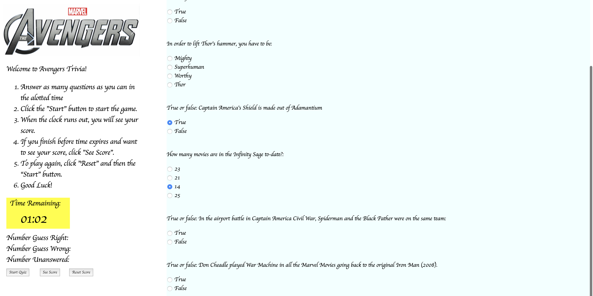

# Trivia Game

## Page preview: 

## About the project:

We had to create a multiple choice and or true false game with the following specs:

  * Create a trivia form with multiple choice or true/false options (your choice).
    
  * The player will have a limited amount of time to finish the quiz.

  * The game ends when the time runs out. The page will reveal the number of questions that players answer correctly and incorrectly.

  * Don't let the player pick more than one answer per question.

  * A countdown timer for the game.

## Techologies used to build:
  * HTML
  * CSS
  * jQuery
  * Javascript

## Methodology:

The logic to accurately count up the incorrect scores and unanswered scores through me for a huge loop (pun not intended).  I went through several js file versions over the weekend.

I ended up sacrificing styling to get the logic down which I think I did that.  I had more grandoise plans heading into the weekend for the layout but as I struggled with the js, I had to focus on that.  If I get dinged on the styling, I'll understand.

The correct, incorrect and unanswered logic works.  The timer works.  I set the time to 70 seconds because I wanted to get the minute format down.

My problem was I initially built all the logic around each radio button as opposed creating a category for each question set.  After I did that Monday after class, everything fell in place.  I leaned on W3Schools and jQuery API docs for using forms and radio buttons.

I also added a markdown file for psuedo coding and basic brainstorming.
